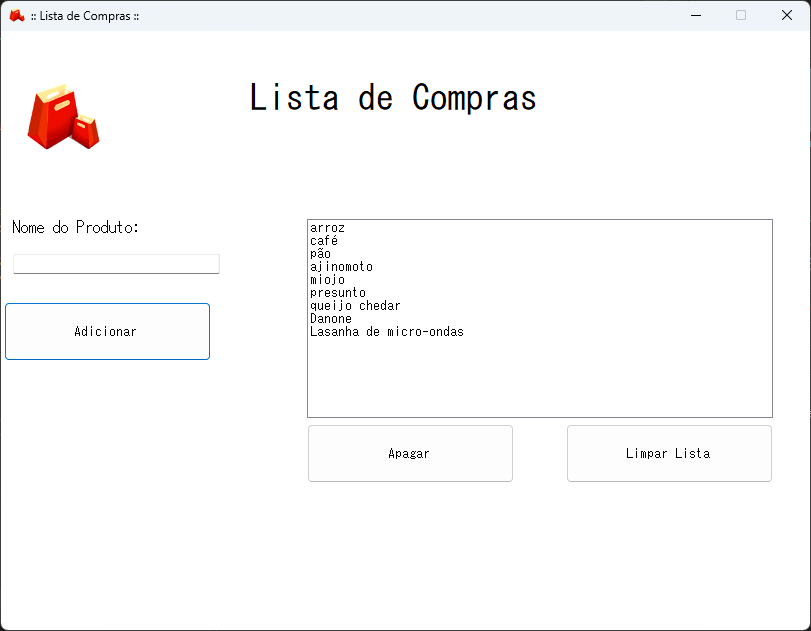

# 🛒 Gerenciador de Lista de Compras - Windows Forms (C#)

Este é um aplicativo simples e funcional de **gerenciamento de lista de compras**, criado com **Windows Forms (WinForms)** em **C#**. Ele permite adicionar, visualizar e remover itens de uma lista de forma rápida e prática por meio de uma interface gráfica amigável.

## 📸 Captura de Tela

---

## ✅ Funcionalidades

- Adicionar itens à lista usando um campo de texto.
- Exibir os itens adicionados em um `ListBox`.
- Remover um item selecionado da lista.
- Limpar todos os itens da lista com um único clique.
- Funcionalidades de usabilidade que melhoram a experiência do usuário:
  - Pressionar `Enter` adiciona diretamente o item.
  - Campo de texto limpo automaticamente após adição.
  - Prevenção de ações inválidas com mensagens de alerta.

---

## 🖥️ Tecnologias Utilizadas

- **Linguagem:** C#
- **Interface Gráfica:** Windows Forms 
- **Framework:** .NET Framework.NET

---
🧠 Como Utilizar

Digite o nome de um item no campo de texto.

Clique em "Adicionar" ou pressione Enter.

O item será exibido no ListBox.

Para remover um item específico, selecione-o e clique em "Remover".

Para apagar todos os itens, clique em "Limpar Tudo".

💡 Possíveis Melhorias Futuras

Salvamento e carregamento automático da lista.

Agrupamento por categorias.

Exportação para arquivos .txt ou .json.

Interface moderna com biblioteca gráfica (ex: MaterialSkin).

📄 Licença

Este projeto está licenciado sob a licença MIT. Veja o arquivo LICENSE para mais detalhes.

🙋‍♂️ Autor

Desenvolvido por Flávio

